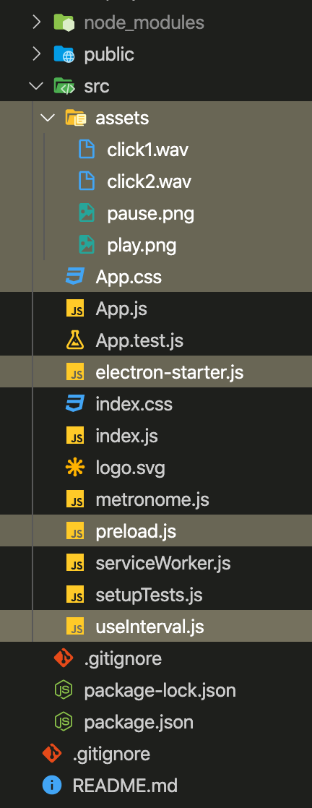

## Initialisation du projet

### 1. Installations et téléchargements

Si ce n'est pas déjà fait, vous pouvez retrouvez la marche à suivre [ici](https://github.com/terencehecq/workshop_react_electron/tree/terence#Avant-le-workshop)

### 2. Mettre en place la structure du projet

- Après l'initialisation, vous avez la structure d'un projet React, voici les dossiers et fichiers à rajouter **depuis le dossier téléchargé** :



<!--
        |- node_modules
        |- public
        |- src
            |- assets             <--
                - click1.wav          <--
                - click2.wav          <--
                - play.png            <--
                - pause.png           <--
            - App.css                <-- (remplacer)
            - electron-starter.js    <--
            - preload.js             <--
            - useInterval.js         <--
            - ...
        - .gitignore
        - package.json
        - README.md
 -->

### 3. Définir le rendu

- Dans le fichier **electron-starter.js**, trouver cette ligne

```javascript
mainWindow.loadFile("index.html");
```

- Et la remplacer par celle-ci :

```javascript
mainWindow.loadURL("http://localhost:3000");
```

### 4. Le package.json

- Dans les scripts, nous ajoutons **electron** et un script **dev** avec _concurrently_ & _wait-on_ qui vont nous permettre

1. De lancer plusieurs scripts en une seule commande
2. D'attendre qu'une action soit terminée avant de lancer la suivante.

```json
"scripts": {
    // ...
    "electron": "electron .",
    "dev": "concurrently \"BROWSER=none npm start\" \" wait-on http://localhost:3000 && npm run electron\""
},

...

"main" : "src/electron-starter.js"
```

Etape suivante : [Communication avec la machine](https://github.com/terencehecq/workshop_react_electron/tree/terence/2.Communication)
