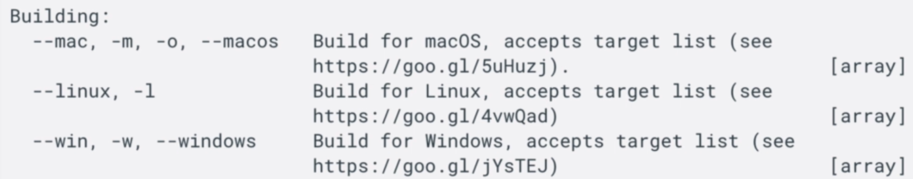
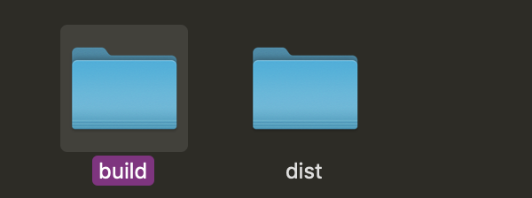
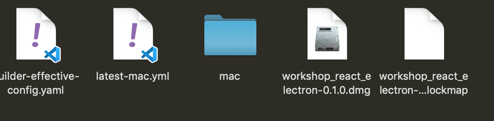
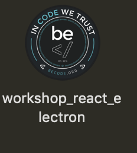
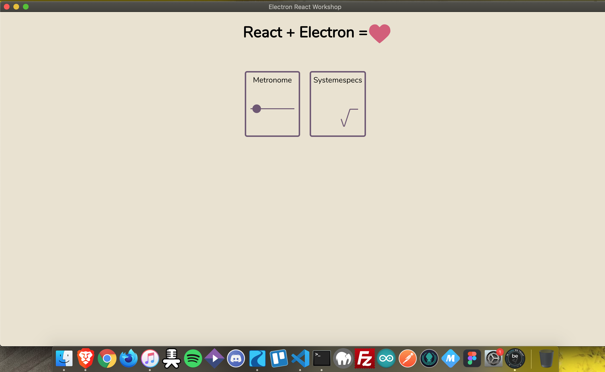

# Exporter l'application:

## 1. Introduction à Electron Builder

Electron Builder est un module à installer en plus d'Electron qui va nous permettre de transformer notre code source en application.

La doc se trouve [ici](https://www.electron.build/).

Avant toute chose il faut savoir que si vous lancer le script d'Electron builder sans rien lui spécifier, il va créer par défaut une application correspondant à l'os sur lequel vous êtes (Mac,Windows, Linux).

De plus par défaut Electron builder va chercher les ressources dont il a besoin dans le dossier build, et ça tombe bien le script de react compile notre code dans un dossier build.

## 2. Les prérequis

Avant tout il faut installer Electron-builder en dépendance de développement: `npm install electron builder -D`.

### 2.1 Configuration du Package.json

Comme expliqué précédement, si on ne précise rien à Electron Builder il va exécuter son script avec les options par défauts.

Ce n'est pas forcément ce que l'on veut, il va donc falloir lui dire quoi faire dans le fichier Package.json:

    "name": "workshop_react_electron",

    "version": "0.1.0",

    "description": "Electron React Workshop",

    "build": {

    "appId": "com.electron.workshop",

    "copyright": "2020 Workshop des barres",

    "win": {

    "target": "NSIS",

    "icon": "build/icon.png"

    },

    "mac": {

    "target": "dmg",

    "icon": "build/icon.icns"

    },

    "linux": {

    "icon": "build/icon.png"

    }

    },

    "author": {

    "name": "joyeux lurons"

    }

Dans ces lignes, on retrouve:

1. En premier lieu , le nom, la version, et la description de l'application, libre à vous de mettre ce que vous voulez.

2. Un object `"build"`, lui même composé de différentes propriétés:

- `appId`: Elle elle séparé par des points et s'écrit à l'envers.
- Un `Copyright`.
- Et les propriétés de build pour les différents OS:
  Pour Windows le format recomandé(`target`) est `NSIS`, On lui Spécifie en suite le chemain de l'icone de l'application, il doit se trouver dans le dossier public pour ensuite être dans le dossier build de react. Le format recomander est en .png ou .ico avec un taille de 256x256px.
  Pour Mac on retrouve la même strucure et on lui spécifie si l'installateur est en format `dmg`ou `pkg`,...
  Le format d'icone doit être en .icns avec une taille de 512x512px.
  Pour Linux c'est un peu plus simple, on doit juste lui spécifier le chemain de l'icone et il prend en charge les .png.
- Et un objet `author`avec les différents auteurs à l'itérieur.

### 2.2 Le script de compilation

Comme on à configuré Electron builder, et qu'avant de transformer notre code en application on doit attendre que React compile son code on a défini dans les script la commande: `"build": "npm run react-build && npm run electron-build"`.
Dans l'ordre ce script va compiler le code de React qui va créer un dossier `build`, ensuite Electron-builder ira voir ce qui se trouve dans se dossier pour exporter le code en application.
Sachez que vous pouvez rajouter des flags au script d'Electron-builder pour lui spécifier quoi faire:

### 2.3 Résulatat

Une fois le code et la configuration terminé, on lance la commande `npm run build`.
***Attention sur windows l'anti virus peut bloquer l'éxécution du script***.
Et si tout se passe bien on obtient cela:

Le dossier build de React, et le dossir dist d'Electron:

On y voit bien l'installateur en `dmg`(dans mon cas).
Et le dossier mac contient mac contient bien notre application :

Et .... TADAM:

